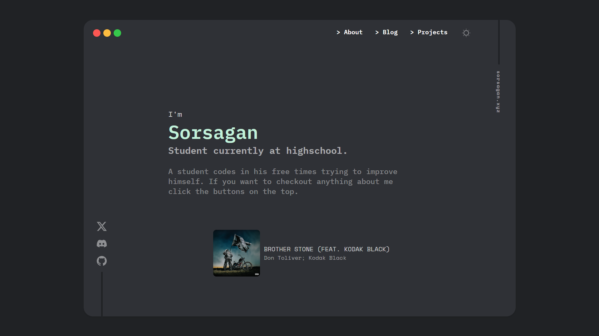

# Simple Portfolio Example

A simple portfolio example created by me (Sorsagan).\
Feel free to use and customize it.\
The links in the header won't work because there's no about, blog or projects page you need to create and customize them yourself.

## Installation

- Follow these steps to get started with the project:

### 1. Clone the Repository

```bash
git clone https://github.com/sorsagan/portfolioexample.git
```

### 2. Update the Commented Sections

There are some links and IDs in the code that need to be changed. All of them are specified with comments for easy identification.
### 3. Host the Website

After cloning the project and making necessary changes, you are ready to go. Use a serverless hosting service (e.g., AWS Lambda, Vercel, GitHub Pages) to host your website.
